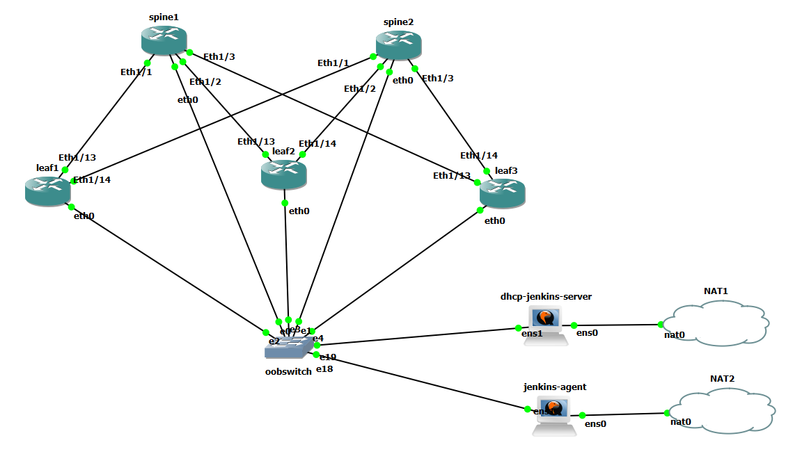

Ansible Repo for Configuring DHCP and ZTD for Dell Switches with Netbox inventory
===============================================

## GNS3 Setup

Device Name | MAC
:------ | :------
spine01   | 0c:4a:4d:11:00:00
spine02   | 0c:ee:a8:0b:00:00
leaf01   | 0c:99:99:3d:00:00
leaf02   | 0c:19:82:35:00:00
leaf03   | 0c:20:2a:e0:00:00

## Install dependencies

PIP
`apt-get install python3-pip` 

CLI of ansible runner (operator or pipeline agent)
`pip3 install --upgrade pip --user`

Add .local/bin to $PATH or operator or pipeline agent

Example export $PATH=$HOME/.local/bin:$PATH

The groovy pipelines handle this when using jenkins

`pip3 install -r requirements.txt --user`  
`ansible-galaxy install -r requirements.yml`

## Playbook Requirements

Environment variables required for NETBOX_API and NETBOX_TOKEN.
Enterprise sonic images from https://www.dell.com/support/home/en-us/product-support/product/enterprise-sonic-distribution/drivers

example
`export NETBOX_API=https://netboxurl.yourorg.com:8000`  
`export NETBOX_TOKEN=0123456789abcdef0123456789abcdef01234555`  

### Running 
`ansible-playbook -i netbox_inventory.yaml Pipelines/playbooks/dhcp.yaml`
`ansible-playbook -i netbox_inventory.yaml Pipelines/playbooks/sonic_ztp.yaml`

## Cloning Netbox
clone netbox-docker and use docker-compose to bring up an instance.
cp netbox.sql /var/lib/docker/volumes/netboxdocker_netbox-postgres-data/_data/
psql -U netbox -d postgres
drop database netbox with (force);
psql -U netbox -d netbox -f netbox.sql

source /opt/netbox/venv/bin/activate
python manage.py createsuperuser

## Jenkins
I just run jenkins as a container

`docker run -d -p 8080:8080 -p 50000:50000 -v jenkins_home:/var/jenkins_home jenkins/jenkins:lts`

### Agent setup
Add a User and add a jdk.  Copy a public key of main server to agent to setup a remote runner.

`sudo apt-get install openjdk-11-jdk`

`sudo useradd jenkins -d /var/lib/jenkins`

